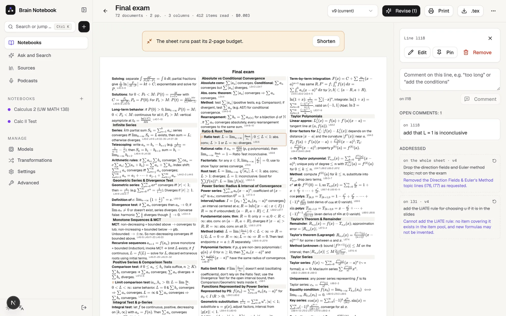
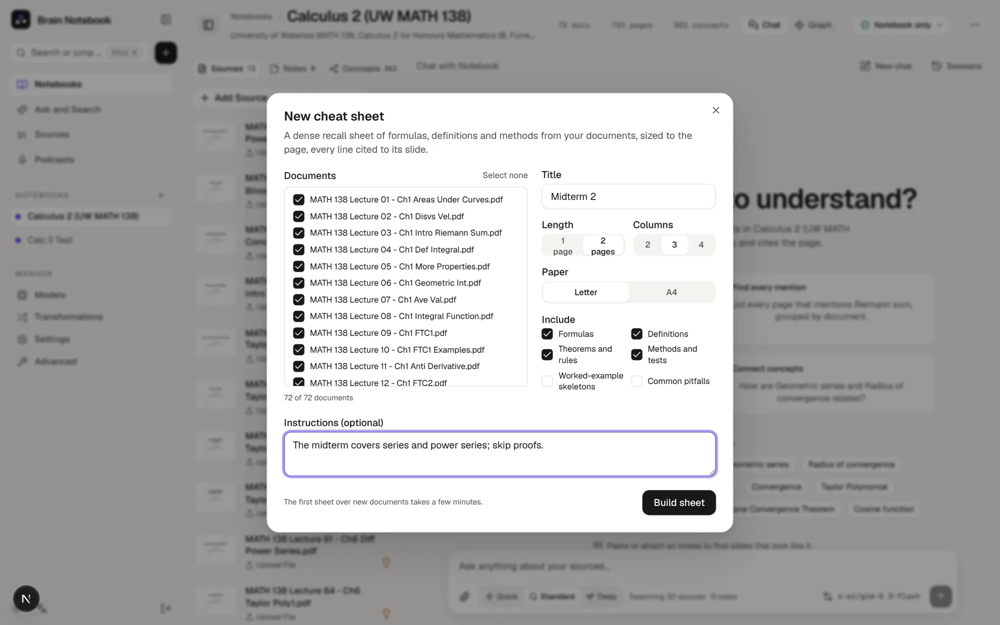
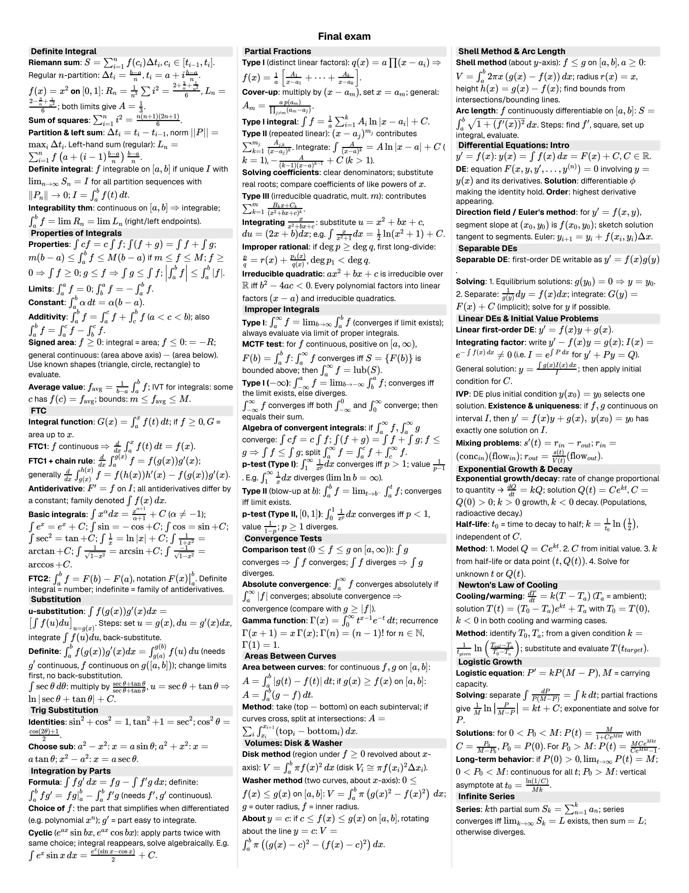

# Cheat Sheets - A Printable Recall Sheet From Your Slides

A cheat sheet is a dense one- or two-page sheet of the formulas, definitions, theorems and methods in the documents
you pick, laid out to fit the paper, written in the course's own notation, with every line citing the slide it came
from. You review it, comment on lines, and **Revise** applies your comments. It prints from the browser and exports
to LaTeX.

It needs the documents to have finished processing (their outline in particular: see
[Adding Sources](adding-sources.md)) and the Tools and Chat models ([API Configuration](api-configuration.md)).

---

## Making one

1. In a notebook, open the **⋯** menu in the header and choose **New cheat sheet…**
2. Pick the documents (all of them, in course order, by default), and optionally:
   - **Title** (e.g. *Midterm 1*).
   - **Length**: 1 or 2 pages. **Columns**: 2, 3 or 4 (more columns use smaller type: 8, 7 or 6 pt). **Paper**:
     Letter or A4.
   - **Include**: formulas, definitions, theorems and rules, methods and tests (the defaults), worked-example
     skeletons, common pitfalls.
   - **Instructions**, e.g. *"The exam covers lectures 1–6; skip proofs."*
3. **Build sheet** opens the sheet's page, which shows progress while it's built.

The first sheet over a set of documents reads every outline section of them (one model call per section; a few
minutes for a course) and keeps what it found, so later sheets over the same documents only lay out the sheet
(about a minute). A course of 72 lecture decks cost about $0.05 for its first sheet with the recommended models,
and about a cent for each later sheet or revision.

---

## The sheet page

The sheet is shown at its printed size; what you see is what prints.

- **Citations**: the small marks after each line (`L45·5` is lecture 45, page 5) open the cited page. Turn them off
  on screen, or on for printing, from the **⋯** menu.
- **Doesn't fit / room left**: the page measures the rendered sheet. If it runs past its pages, **Shorten** asks
  for a shorter version; if a good part is still empty, **Add more** fills it from what wasn't used.
- **Versions**: every build, revision, Shorten and Add more makes a new version; the version menu shows older ones
  (read-only).
- **Print** uses the browser's print dialog (choose *Save as PDF* for a file); set margins to *None* if your browser
  adds its own. **.tex** downloads a LaTeX document of the same sheet (`multicols`, `amsmath`) for Overleaf or a
  local TeX install.

## Reviewing and revising

Click a line to select it. In the panel on the right you can:

- **Comment** on it ("too long", "add the conditions", "drop this"), or, with no line selected, comment on the whole
  sheet ("missing the ratio test", "more on improper integrals").
- **Edit** it by hand. Edited lines are kept word for word by later revisions.
- **Pin** it. Pinned lines stay through Revise, Shorten and Add more.
- **Remove** it.

**Revise** applies the open comments and makes a new version. Each comment is marked *addressed* with a note on what
changed, or why it couldn't be done (for example, a formula that isn't in the selected documents). Reopen a comment
to have the next revision try again.

The sheet never adds content that isn't in your documents: every line is built from what was read from specific
pages, and its citations come from those pages, not from the model.

---

## Tips

- Pick the documents an exam covers rather than the whole notebook: the sheet has a fixed amount of room.
- Instructions steer what gets the room: *"prioritize series tests and Taylor series"*, *"skip definitions I'd
  know"*.
- If formulas look wrong, check the cited page: equations are read from the slides' text and the image captions,
  and a garbled slide can produce a garbled formula. Edit the line, or comment on it and revise.
- A document added to the notebook later isn't on existing sheets; make a new sheet that includes it.
