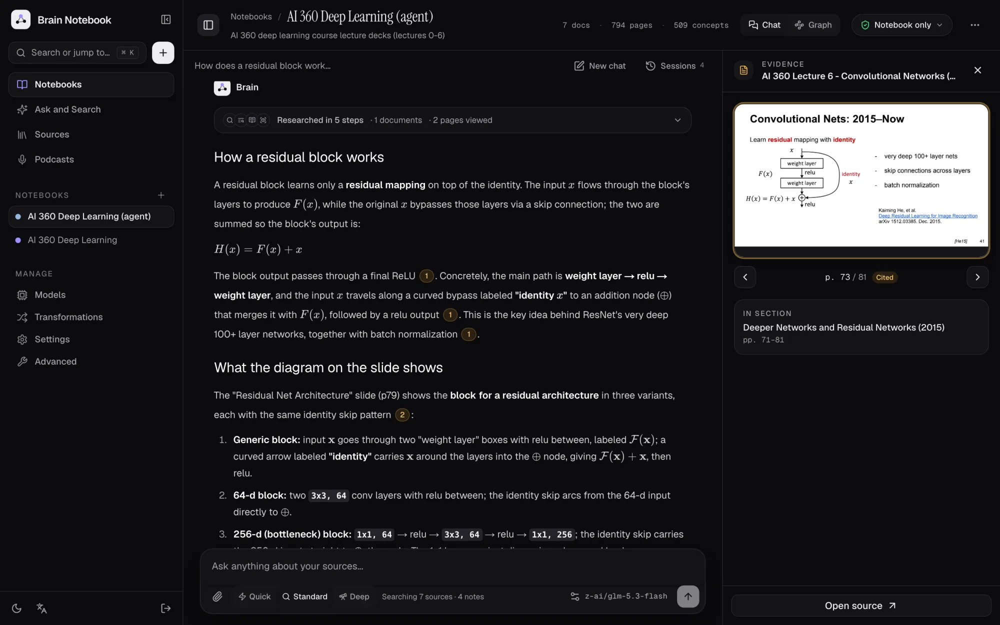
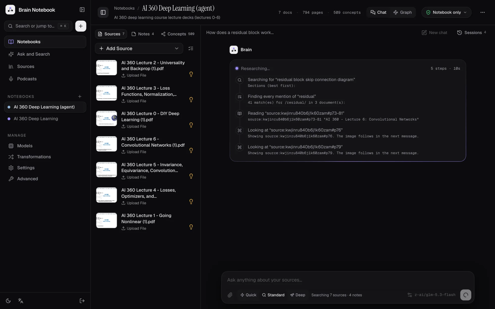
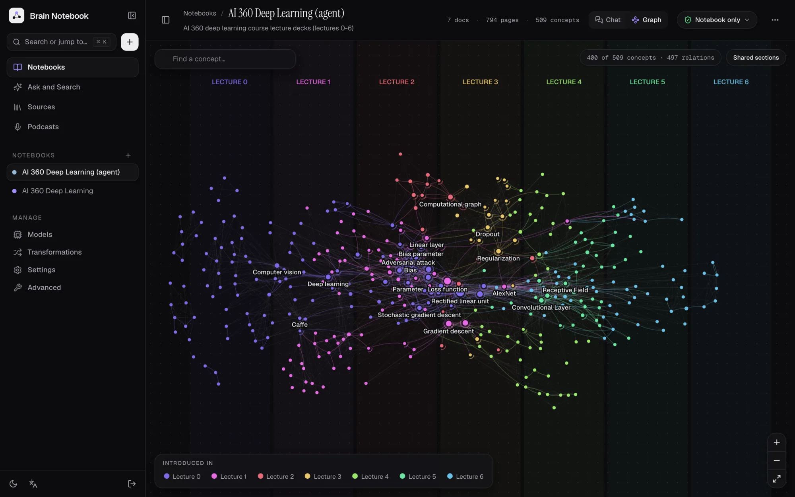
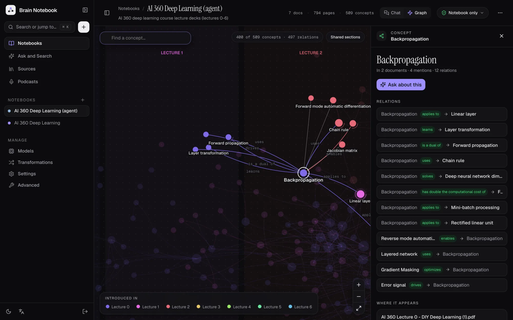
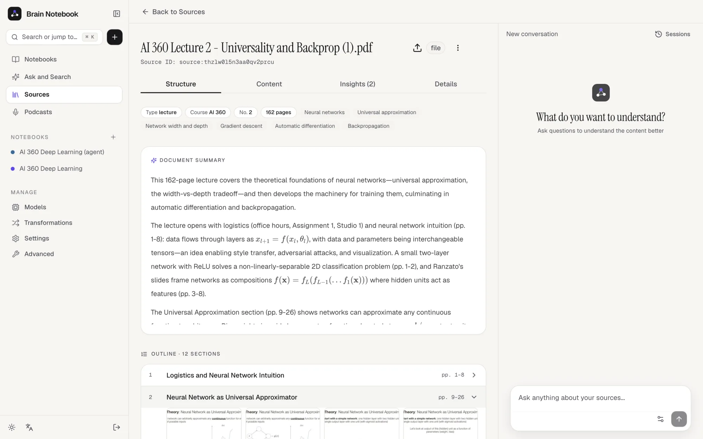

# Interface Overview - Finding Your Way Around

## The Sidebar

Every page has a sidebar on the left. Collapse it to an icon rail with the panel button next to the name; on phones
it's always the icon rail.

```
┌──────────────────────────┐
│ ◆ Brain Notebook      ⊟  │
│ [Search or jump to… ⌘K][+]│  + → Notebook, Source, Podcast
│                          │
│   Notebooks              │
│   Ask and Search         │
│   Sources                │
│   Podcasts               │
│                          │
│ NOTEBOOKS            +   │
│   ● Course notes         │  your notebooks, one click away
│   ● Thesis reading       │
│                          │
│ MANAGE                   │
│   Models                 │
│   Transformations        │
│   Settings               │
│   Advanced               │
├──────────────────────────┤
│ ☀  文A               ⇥   │  theme · language · sign out
└──────────────────────────┘
```

| Item | What it's for |
|------|---------------|
| **Search or jump to…** | The command palette (also **⌘K** / **Ctrl+K**): jump to pages and notebooks, search or ask, create items, change theme |
| **+** | Create a notebook, source or podcast episode from anywhere |
| **Notebooks** | Home: ask across all notebooks, jump back into recent items, and your notebooks as cards |
| **Ask and Search** | Ask questions across your knowledge base, or search it ([Search and Ask](search.md)) |
| **Sources** | Your source library: every source, whichever notebooks it is in |
| **Podcasts** | Generated episodes and the episode/speaker profiles ([Creating Podcasts](creating-podcasts.md)) |
| **Notebooks list** | Your active notebooks; the hover number is the document count |
| **Models** | AI provider configurations and default models ([API Configuration](api-configuration.md)) |
| **Transformations** | Your transformation prompts and the Playground ([Transformations](transformations.md)) |
| **Settings** | Content Processing, Embedding and Search, File Management, Research agent |
| **Advanced** | System Info (version and update check) and Rebuild Embeddings |
| **Quick actions** | The command palette: jump to pages and notebooks, search or ask, create items, change theme |
| **Theme / Language** | Light, dark or system theme; interface language |

---

## The Notebook Page

A notebook opens as a research workspace: the library on the left, the conversation in the middle, and the evidence
panel on the right when you open a citation or a concept.



```
┌────────────────────────────────────────────────────────────────────────────────┐
│ ⊟ Notebooks / Course notes   7 docs · 794 pages · 509 concepts [Chat|Graph] [Notebook only ▾] ⋯ │
│    description (click to edit)                                                 │
├───────────────────┬──────────────────────────────────────┬─────────────────────┤
│ Sources│Notes│Concepts │ conversation title  [New chat] [Sessions] │ EVIDENCE      ✕ │
│ [+ Add Source] [☰]│                                      │ ┌─────────────────┐ │
│ ▣ Lecture 2       │  ◆ Brain                             │ │ rendered page   │ │
│   topics…      ◐ ⋮│  ▸ Researched in 5 steps · 2 docs    │ └─────────────────┘ │
│ ▣ Lecture 3       │  answer text with citations ①②       │ ‹  p. 28 / 162  ›   │
│                   │  SOURCES · 3  [thumb][thumb][thumb]  │ In section …        │
│                   │ ┌──────────────────────────────────┐ │                     │
│                   │ │ Ask anything…                    │ │                     │
│                   │ │ 📎 [Quick|Standard|Deep]  model ↑ │ │ [Open source ↗]     │
│                   │ └──────────────────────────────────┘ │                     │
└───────────────────┴──────────────────────────────────────┴─────────────────────┘
```

The library hides with the panel button at the top left (and gives way to the evidence panel on narrower screens).
On phones the panes become tabs: **Chat**, **Sources**, **Notes** and **Concepts**; evidence opens full screen.

### Header

The notebook name and description (click to edit), the notebook's size (documents, pages, concepts; click the
concept count to open the Concepts tab), the **grounding** switch (**Notebook only**, or **+ General knowledge**,
which also allows web search when it's on; see [grounding](chat-effectively.md#the-controls))
and **⋯** with **Archive** and **Delete**.

### Library: Sources

- **Add Source** opens a menu: **Add Source** (the wizard for new content) or **Add Existing Sources** (link sources from your library). See [Adding Sources](adding-sources.md).
- **☰** (context) sets every source at once: **Include all (insights only)**, **Include all (full content)** or **Exclude all from context**.
- Each **source row** shows page one as a thumbnail, the title, its topics (or type) and the processing status while it isn't finished. The **context icon** cycles whether the source is in the research agent's [scope](../2-CORE-CONCEPTS/ai-context-rag.md#scope-what-the-agent-may-look-at) (*Insights only* and *Full content* both mean in scope; excluded sources are dimmed). The **⋮ menu** has **Remove from Notebook**, **Retry Processing** (failed sources), **Refresh content** (completed links) and **Delete Source**.
- Click a row to open the source view.

### Library: Notes

- **Write Note** creates a note; **☰** includes or excludes every note.
- Each **note card** shows whether it's AI generated or yours, when it changed, the title and the start of the text, and a context icon. Click a card to edit the note. See [Working with Notes](working-with-notes.md).

### Library: Concepts

The notebook's [concept graph](../2-CORE-CONCEPTS/ingestion.md) as a list, most shared first; the bar shows how many
documents mention each concept. Filter it by name and click a concept to open it in the evidence panel.

### Conversation

Chat with the research agent over the sources and notes in scope. An empty conversation shows what the notebook holds,
starter questions built from its key concepts (trace an idea, find every mention, read a diagram, connect concepts)
and the key concepts themselves. **New chat** starts an empty conversation; **Sessions** lists your saved ones.

The message box has the paperclip (or paste, or drop) to attach images, **Effort** (Quick / Standard / Deep), what the
agent will search ("Searching 7 sources · 4 notes"), the answer model, and send. **Enter** sends; **Shift+Enter**
starts a new line.



While the agent works, its research steps appear live with the tool, what it looked for and what it found. Each answer
keeps them folded into one line (**Researched in N steps**), shows its citations as numbered chips (hover one to see
the cited page) and ends with thumbnails of every cited page. See [Chatting with the agent](chat-effectively.md).

### Graph



**Graph** (next to **Chat** in the header) replaces the conversation with the notebook's concept graph as a map.
Each document is a column, left to right in course order; a concept sits between the documents that mention it,
in the colour of the one that introduces it, and bigger the more it's mentioned (a ring means it spans documents).
Curved links are relations the documents state ("uses", "is a type of"); faint straight links join concepts that share
a section (**Shared sections** turns them off).

- **Hover** a concept to focus it: its neighbours stay lit, relation names appear, and a card shows its documents.
- **Click** it to open it in the evidence panel; **drag** to move it; scroll or **+ / −** to zoom; **⤢** fits the view.
- **Find a concept…** flies to it. The **Introduced in** legend filters to one document.

The graph shows the 400 most shared concepts (the count is top right). Asking about a concept switches back to Chat.

**Map / 3D** (top centre) switches to a 3D view of the same graph, still left to right by lecture: it orbits slowly
until you drag (**Orbit** restarts it), right-drag pans, scroll zooms. Hover or click a concept to light its
neighbourhood and send particles along its relations; the search box flies the camera to a concept. The map is
better for reading; 3D is for exploring.



### Evidence panel

- **A page citation** opens the rendered page, marked *Cited*, with the arrows to move through the document, the
  outline section it belongs to, the other pages of the cited range, and **Open source**.
- **A concept** shows its relations to other concepts (click one to follow it), every document and page range that
  mentions it (click a page to see it), and **Ask about this**, which asks the agent to explain it.

---

## The Source View

Clicking a source opens it with these tabs:



- **Structure** (paged sources): the document's metadata and topics, its summary, the outline with page ranges (open
  a section for its pages and summary), the concepts it mentions and every page as a thumbnail. Click a page to view
  it large.
- **Content**: the extracted text and, for YouTube links, the embedded video.
- **Insights**: the insights generated by transformations, and **Generate New Insight** to run another one. See [Transformations](transformations.md).
- **Details**: topics, embedding status, created and updated dates, and the notebooks the source belongs to (**Manage Notebooks**).

**Chat with Sources** opens the source's own page, with the source on the left and a chat about it on the right. The **⋮ menu** has **Download File** (uploaded files, while the file is still stored), **Embed Content** (if the source isn't embedded yet) and **Delete Source**.

---

## Other Pages

- **Sources** (library): a table of all sources with type, insight count and embedding status. **New Source** adds a source without opening a notebook.
- **Notebooks** (home): a question box that asks across all notebooks (it opens Ask), **Jump back in** (recently viewed notebooks and sources), and your notebooks as cards with their first pages as covers, counts and grounding; search, tile or list view, **New Notebook** and the **Archived Notebooks** list.
- **Settings**: Content Processing (document and URL engines, OCR and other Docling options; see [Content Processing Engines](content-processing-engines.md)), Embedding and Search (**Default Embedding Option**: Ask, Always or Never), File Management (**Auto Delete Files**: whether uploaded files are deleted after processing; keep it at *No* so the agent can look at pages), and **Research agent** (rerank model, page-image embedding model, concept graph, memory, web search, backfills and the list of remembered items; see [Research agent settings](../5-CONFIGURATION/research-agent.md)).
- **Advanced**: **System Info** shows your version and whether an update is available. **Rebuild Embeddings** re-embeds content after you change the embedding model (mode *Existing* or *All*); it runs in the background.

---

## Keyboard Shortcuts

| Shortcut | Where | Action |
|----------|-------|--------|
| **Ctrl+K** / **⌘K** | Anywhere | Open Quick actions (command palette) |
| **Enter** | Chat message box | Send |
| **Shift+Enter** | Chat message box | New line |
| **Enter** | Ask question box | Ask |
| **Enter** | Search box | Search |
